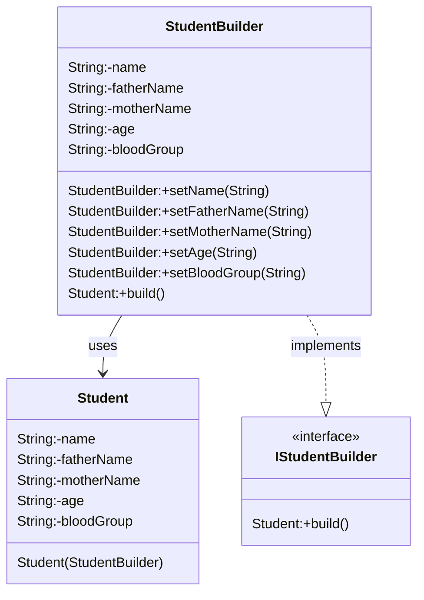

# Builder

## Steps to create builder

1. Create builder class (StudentBuilder)
2. Add same parameters like main class (Student)
3. Add setters in builder class (StudentBuilder)
4. Add build method in builder class which return new object for Student
5. Add constructor in main class which take builder as parameter
6. Set properties from builder to objects in constructor

## Class Diagram

