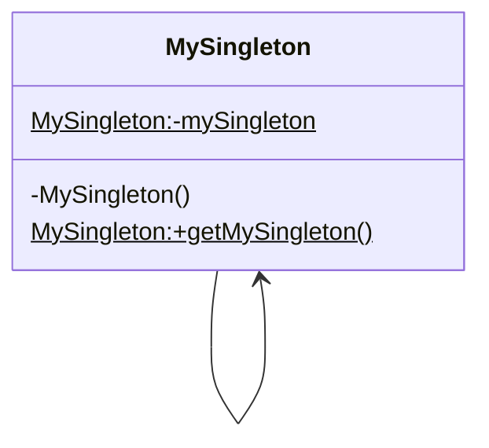

Singleton need three steps

1. Create private constructor to avoid getting used out of class.
2. Create static reference of same class
3. Create static method to get instance (synchronized for thread safe)

